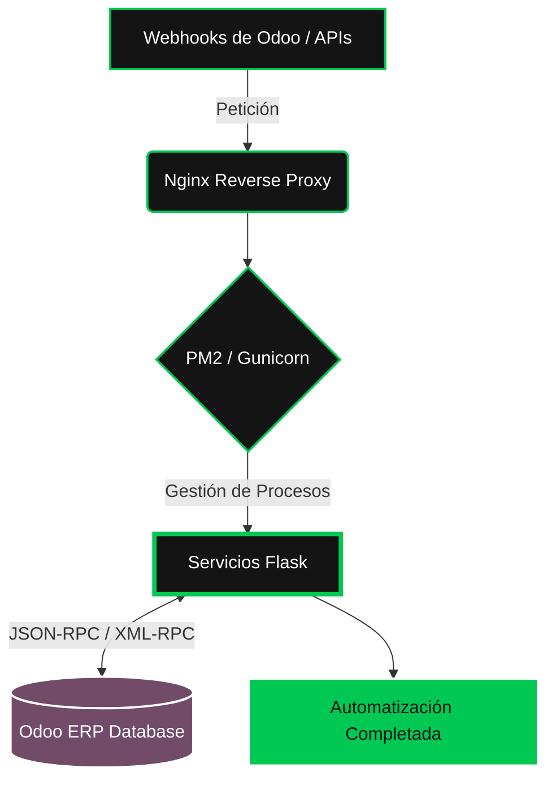

<!-- Header Animado -->

<!-- Texto con efecto de máquina de escribir animado -->

  
  

<!-- Separador animado -->

 

<table>
  <tr>
    <td width="30%" align="center">
      <!-- GIF de desarrollador animado -->
      
    </td>
    <td width="70%">
      <h3>⚡ Automatización e Integración Backend</h3>
      
Bienvenido a mi espacio de ingeniería en <b>Wondertech</b>. Mi objetivo principal es construir microservicios robustos, automatizar flujos de trabajo tediosos y expandir las capacidades de <b>Odoo ERP</b> mediante integraciones inteligentes y código limpio.

    </td>
  </tr>
</table>

 

<!-- Separador animado -->

  <h2>🚀 Proyectos y Microservicios (Repositorios Privados)</h2>

<table width="100%">
  <!-- FILA 1 -->
  <tr>
    <td width="50%" valign="top">
      <h3 align="center"> excel-terceros-odoo</h3>
      

      
Sincronización masiva de partners (Excel/JSON) con validación avanzada de <b>NIT Colombiano</b> y resolución Many2one para el ORM de Odoo.

      
<code>Flask</code> <code>Odoo</code> <code>JSON-RPC</code>

    </td>
    <td width="50%" valign="top">
      <h3 align="center"> webhook_uvt_iva</h3>
      

      
Servicio automatizado que ajusta el <b>IVA (0% o 19%)</b> en Odoo validando dinámicamente los límites de UVT en Colombia para computadores.

      
<code>Python</code> <code>Webhooks</code> <code>Automation</code>

    </td>
  </tr>
  
  <!-- FILA 2 -->
  <tr>
    <td width="50%" valign="top">
      <h3 align="center"> webhook_scrap</h3>
      

      
Backend de Web-Scraping para consulta en línea del <b>RUES</b>, extrayendo y normalizando datos corporativos vía API hacia Odoo.

      
<code>Scraping</code> <code>API Rest</code> <code>Flask</code>

    </td>
    <td width="50%" valign="top">
      <h3 align="center"> instagram_odoo_msn</h3>
      

      
Integración en tiempo real entre <b>Instagram DMs</b> y Odoo Discuss. Creación automática de canales y reenvío de mensajes JSON-RPC.

      
<code>Meta API</code> <code>JSON-RPC</code> <code>Odoo Discuss</code>

    </td>
  </tr>

  <!-- FILA 3 -->
  <tr>
    <td width="50%" valign="top">
      <h3 align="center"> Servientrega_script</h3>
      

      
Scripts operativos para integración de servicios de <b>Servientrega</b>. Optimización del manejo de datos y ejecución de despachos.

      
<code>Python Scripting</code> <code>Logistics</code>

    </td>
    <td width="50%" valign="top">
      <h3 align="center"> Flujos y Enriquecimiento</h3>
      

      
Gestión de <b>Flujo_excel</b> vía Power Automate y enriquecimiento de leads con <b>Search_linkedIn</b> utilizando PM2, Nginx y Google CSE.

      
<code>Power Automate</code> <code>Nginx</code> <code>Google CSE</code>

    </td>
  </tr>
</table>

 

<!-- Separador animado -->

   
  <!-- Footer Animado de Wondertech -->
  
  
  

    <b>Cristian Ruiz</b> | <i>Junior Developer</i>
  

>
  
  <h3>Arquitectura de Despliegue</h3>

<b>Cristian Ruiz</b> | <i>Junior Developer</i>

